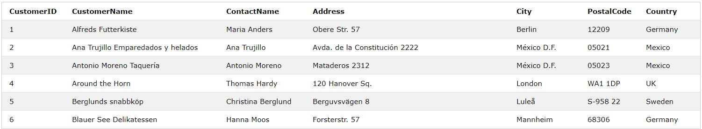
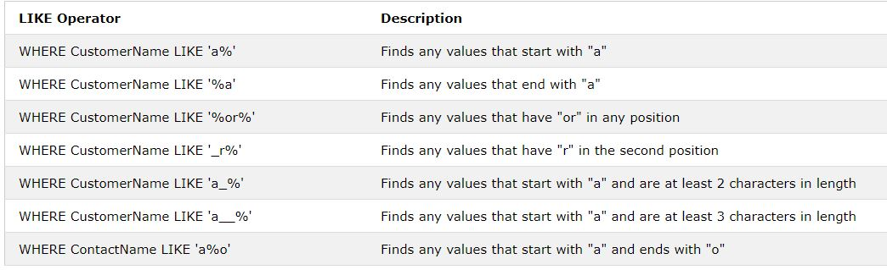
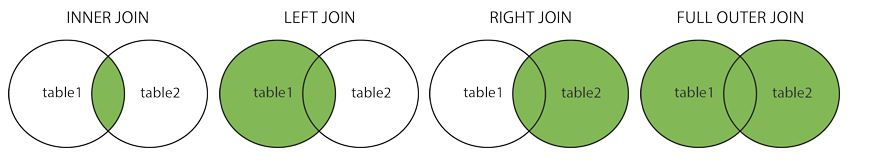

# :minidisc: SQL Note
- SQL is use to handle data in database 

# :page_with_curl: SELECT 

```sql
SELECT column_name1, column_name2,...
FROM Table_name;
```

Here column_name1, column_name2,... are attributes of tables you want to select. 
If you want to select all the column from Table, use the following syntax:

```sql
SELECT * 
FROM Table_name;
```

Example: 
```sql
SELECT CustomerName, City 
FROM Customers;
```


## :fast_forward: Select Distinct

Syntax:
```sql
SELECT DISTINCT column1, column2,...
FROM table_name;
```

Example:
```sql
SELECT DISTINCT Country
FROM Customers;
```

# :page_with_curl: WHERE Clause

Syntax:
```sql
SELECT column1, column2,...
FROM table_name;
WHERE condition
```

Example:
```sql
SELECT Country
FROM Customers;
WHERE Country = "Mexico";
```

### Operators for WHERE Clause:


## :fast_forward: AND, OR and NOT Operator

- WHERE clauses can have a combination of AND, OR and NOT operator.

- AND operator display the result if both side of the operator is true
- OR operator display the result if anyone side is true.
- NOT operator display the result if condition is NOT TRUE.

### :arrow_right_hook: AND Operator Syntax:
```sql
SELECT column1, column2,...
FROM table_name;
WHERE condition AND condition2 AND condition3,...;
```

Example:
```sql
SELECT * FROM Customers
WHERE Country='Germany' AND City='Berlin';
```
### :arrow_right_hook: OR Operator Syntax:
```sql
SELECT column1, column2, ...
FROM table_name
WHERE condition1 OR condition2 OR condition3 ...;
```

Example:
```sql
SELECT * FROM Customers
WHERE City='Berlin' OR City='München';
```
### :arrow_right_hook: NOT Operator Syntax:
```sql
SELECT column1, column2, ...
FROM table_name
WHERE NOT condition;
```

Example:
```sql
SELECT * FROM Customers
WHERE NOT Country='Germany';
```

### :arrow_right_hook: Combination of AND and OR operator:

```sql
SELECT * FROM Customers
WHERE Country='Germany' AND (City='Berlin' OR City='München');
```
RESULT:


# :page_with_curl: ORDER BY 

ORDER BY keyword is used to sort the result by ascending (ASC) or descending (DESC) 

### ORDER BY Syntax:

```sql
SELECT column1, column2, ...
FROM table_name
ORDER BY column1, column2, ... ASC|DESC;
```
Example: by default ORDER BY is ascending (ASC)
```sql
SELECT * FROM Customers
ORDER BY Country;
```
Example: Descending
```sql
SELECT * FROM Customers
ORDER BY Country DESC;
```

### :fast_forward: ORDER BY multiple columns:

- With multiple columns, it means that first column will be sorted and if there are any same value then it will use next column to sort it. 

Example: First it orders by Country, but if some rows have the same Country, it orders them by CustomerName
```sql
SELECT * FROM Customers
ORDER BY Country, CustomerName;
```


# :page_with_curl: INSERT INTO

INSERT INTO is used to insert new record into the table


###  :fast_forward: INSERT INTO Syntax:
- There are TWO ways
  
:arrow_right_hook: First one: Using both column name and values to be inserted

```sql
INSERT INTO table_name (column1, column2, column3, ...)
VALUES (value1, value2, value3, ...);
```
Example: Mention both column and value to be inserted
```sql
INSERT INTO Customers (CustomerName, ContactName, Address, City, PostalCode, Country)
VALUES ('Cardinal', 'Tom B. Erichsen', 'Skagen 21', 'Stavanger', '4006', 'Norway');
```
 
:arrow_right_hook: Second one: Using only values to insert it in to all column. Order of values matters

```sql
INSERT INTO table_name
VALUES (value1, value2, value3, ...);
```


# :page_with_curl: NULL Value

NULL is value not like zero as it has no value at all. Optional fields in Database with no value has NULL.

### :fast_forward: NULL checker
- IS NULL
- IS NOT NULL

```sql
SELECT column_names
FROM table_name
WHERE column_name IS NULL;
```
:arrow_right_hook: Example: Result with all address with no value.
```sql
SELECT CustomerName, ContactName, Address
FROM Customers
WHERE Address IS NULL;
```


# :page_with_curl: UPDATE Statement

UPDATE is use to modify the existing data/records in a table

###  :fast_forward: UPDATE Syntax:
- Remember to use WHERE clauses to choose specific data.
- All data will be updated if you fails to mention/use WHERE clause. 

```sql
UPDATE table_name
SET column1 = value1, column2 = value2, ...
WHERE condition;
```
:arrow_right_hook: Example: Updating record with CustomerID equals to 1
```sql
UPDATE Customers
SET ContactName = 'Alfred Schmidt', City= 'Frankfurt'
WHERE CustomerID = 1;
```


# :page_with_curl: DELETE Statement

DELETE is use to remove/delete record in the table.

###  :fast_forward: DELETE Syntax:
- Remember to use WHERE clauses to choose specific data.
- All data will be deleted if you fails to mention/use WHERE clause. 

```sql
DELETE FROM table_name WHERE condition;
```
:arrow_right_hook: Example: Deleting a record where CustomerName is equal to "Alfreds Futterkiste".
```sql
ELETE FROM Customers WHERE CustomerName='Alfreds Futterkiste';
```


# :page_with_curl: TOP, LIMIT or ROWNUM 

SELECT TOP is used to specify some number of record to return.

###  :fast_forward: SELECT TOP Syntax:
- Remember that SELECT TOP is not support in stall database sytems.

```sql
SELECT TOP number|percent column_name(s)
FROM table_name
WHERE condition;
```

###  :fast_forward: LIMIT Syntax:
- SELECT TOP is equit to LIMIT in MySQL

```sql
SELECT column_name(s)
FROM table_name
WHERE condition
LIMIT number;
```
###  :fast_forward: ROWNUM Syntax:
- SELECT TOP is equit to ROWNUM in Oracle

```sql
SELECT column_name(s)
FROM table_name
WHERE ROWNUM <= number;
```

:arrow_right_hook: Example: Three statement below will return same result.
- SQL
```sql
SELECT TOP 3 * FROM Customers;
```
- MySQL
```sql
SELECT * FROM Customers
LIMIT 3;
```
- Oracle
```sql
SELECT * FROM Customers
WHERE ROWNUM <= 3;
```
###  :fast_forward: TOP PERCENT example:
- Return percentage of record from the data.

:arrow_right_hook: Example: 
- From 12 customer record, only 50% will be return.
- Only 6 will return.

```sql
SELECT TOP 50 PERCENT * FROM Customers;
```




# :page_with_curl: MIN() and MAX() Function

Min() and MAX() is a function that will return a MINIMUM/MAXIMUM value from a given column.

###  :fast_forward: MIN() Syntax:

```sql
SELECT MIN(column_name)
FROM table_name
WHERE condition;
```
:arrow_right_hook: Example: Return smallest price from price column.
```sql
SELECT MIN(Price) AS SmallestPrice
FROM Products;
```

###  :fast_forward: MAX() Syntax:

```sql
SELECT MAX(column_name)
FROM table_name
WHERE condition;
```
:arrow_right_hook: Example: Return largest price from price column.
```sql
SELECT MAX(Price) AS LargestPrice
FROM Products;
```


# :page_with_curl: COUNT(), AVG() and SUM() Function

The COUNT() function returns the number of rows that matches a specified criterion.

The AVG() function returns the average value of a numeric column.

The SUM() function returns the total sum of a numeric column.

###  :fast_forward: COUNT() Syntax:

```sql
SELECT COUNT(column_name)
FROM table_name
WHERE condition;
```

:arrow_right_hook: Example: Finds the number of products:
Note: NULL values are not counted.
```sql
SELECT COUNT(ProductID)
FROM Products;
```

###  :fast_forward: AVG() Syntax:

```sql
SELECT AVG(column_name)
FROM table_name
WHERE condition;
```

:arrow_right_hook: Example: Finds the average price of all products:
```sql
SELECT AVG(Price)
FROM Products;
```


# :page_with_curl: LIKE Operator

LIKE Operator is used in a WHERE clause to search for a specific pattern in a column.

Pattern like finding names with first letter "T".

###  :fast_forward: LIKE Syntax:

```sql
SELECT column1, column2, ...
FROM table_name
WHERE columnN LIKE pattern;
```
### Here are some examples of LIKE Operator with '%' and '_'.




:arrow_right_hook: Example: Finds the all customer who's name starts with 'a':
```sql
SELECT * FROM Customers
WHERE CustomerName LIKE 'a%';
```

:arrow_right_hook: Example: Finds the all customer who's name have 'r' in the second position:
```sql
SELECT * FROM Customers
WHERE CustomerName LIKE '_r%';
```


# :page_with_curl: IN Operator

IN operator allow you to have multiple values in WHERE clause.

IN Operator is a shorthand for multiple OR condition.

###  :fast_forward: IN Syntax:

```sql
SELECT column_name(s)
FROM table_name
WHERE column_name IN (value1, value2, ...);
```
### OR

```sql
SELECT column_name(s)
FROM table_name
WHERE column_name IN (SELECT STATEMENT);
```


:arrow_right_hook: Example: Finds the all customer who are located in 'Germany', 'France' and 'Uk':
```sql
SELECT * FROM Customers
WHERE Country IN ('Germany', 'France', 'UK');
```

:arrow_right_hook: Example: Finds the all customer who are from the same countries as the suppliers:
```sql
SELECT * FROM Customers
WHERE Country IN (SELECT Country FROM Suppliers);
```


# :page_with_curl: BETWEEN Operator

BETWEEN Operator selects values within a given range. (Value = number,text,dates)
BETWEEN Operator consider value at the beginning and ending. (Inclusive)


###  :fast_forward: BETWEEN Syntax:

```sql
SELECT column_name(s)
FROM table_name
WHERE column_name BETWEEN value1 AND value2;
```


:arrow_right_hook: Example: Find all products with a price BETWEEN 10 and 20:
```sql
SELECT * FROM Products
WHERE Price BETWEEN 10 AND 20;
```

:arrow_right_hook: Example: Find all products with a ProductName BETWEEN Carnarvon Tigers and Mozzarella di Giovanni:
```sql
SELECT * FROM Products
WHERE ProductName BETWEEN 'Carnarvon Tigers' AND 'Mozzarella di Giovanni'
ORDER BY ProductName;
```

:arrow_right_hook: Example: Find all orders with an OrderDate BETWEEN '01-July-1996' and '31-July-1996':

Example
```sql
SELECT * FROM Orders
WHERE OrderDate BETWEEN #01/07/1996# AND #31/07/1996#;
```


# :page_with_curl: Aliases (AS)

Aliases is a naming style used in SQL to give temporary name to Table, Column, result.

###  :fast_forward: Aliases Syntax:

```sql
SELECT column_name AS alias_name
FROM table_name;
```


:arrow_right_hook: Example: Creates two aliases, one for the CustomerID column and one for the CustomerName column:
```sql
SELECT CustomerID AS ID, CustomerName AS Customer
FROM Customers;
```


# :page_with_curl: SQL JOINS

A JOIN clause is used to combine rows from two or more tables, based on a related column between them.

## Different Types of SQL JOINs

###  :fast_forward: Aliases Syntax:
1. (INNER) JOIN: Returns records that have matching values in both tables
2. LEFT (OUTER) JOIN: Returns all records from the left table, and the matched records from the right table
3. RIGHT (OUTER) JOIN: Returns all records from the right table, and the matched records from the left table
4. FULL (OUTER) JOIN: Returns all records when there is a match in either left or right table



